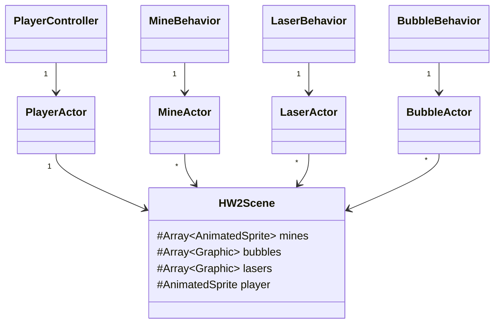

# Homework 2 - CSE 380 - Spring 2023
- Peter Walsh - peter.t.walsh@stonybrook.edu
- Professor Richard McKenna - richard@cs.stonybrook.edu
### Due Date: Friday, February 24, 2022

> I've put together this homework document as a resource/reference for you guys. If you guys think this thing is useful, please let me know. Alternatively, if you think these docs are a phenomenal waste of my time, please let me know.
> 
> I suspect that as the semester progresses things in the actual homework codebase will change. If you notice a discrepency between the homework doc and the comments/code in the assignment, please let me know. 
>
> Peter 😜

## Introduction
In this assignment, you will make an infinite scroller game using the Typescript programming language and the Wolfie2D game engine. By completing this assignment, you should start to become familiar with the Wolfie2D game engine and develop an understanding of:

* How to receive and respond to game events use Wolfie2D's EventQueue
* Deal with simple collision detection
* Load sprites and animated sprites in Wolfie2D
* Define a custom shader in Wolfie2D
* Record and replay games in Wofie2D
* Set random numbers/seeds in Wolfie2D

## Reading Material
Not to sound like a complete and total nerd, but [Game Programming Patterns](https://gameprogrammingpatterns.com/contents.html) (your textbook) is actually a really great textbook if you're interested in design patterns for games. For this homework assignment, these 4 chapters are probably the most relevant.

* [Game-loop](https://gameprogrammingpatterns.com/game-loop.html)
* [Update Method](https://gameprogrammingpatterns.com/update-method.html)
* [Event Queue](https://gameprogrammingpatterns.com/event-queue.html)
* [Object Pool](https://gameprogrammingpatterns.com/object-pool.html)

## Getting Started
First, you'll need to clone the base code in this repository and setup a repository on Github. After you've cloned the base code, run `npm install`. Once the node modules have installed, run `gulp` to transpile the hw2 base code. 

> If you've never worked with git, Github, or a node project and you don't know how to get setup, please reach out to myself (Peter) or Kevin 🙂 

## Codebase Files
The structure of the hw2 codebase looks similar to the tree diagram shown below.
```
.
├── LICENSE.md
├── README.md
├── dist
│   ├── builtin
│   ├── demo_assets
│   └── hw2_assets
│       ├── shaders                   <-- Homework 2 shaders
│       │   ├── bubble.fshader
│       │   ├── bubble.vshader
│       │   ├── laser.fshader
│       │   └── laser.vshader
│       ├── sprites
│       │   ├── SpikyMineThing.png
│       │   └── WavyBlueLines.png
│       └── spritesheets
│           ├── AYellowBarrelWithWindows.json
│           ├── AYellowBarrelWithWindows.png
│           ├── SpikyMineThing.json
│           └── SpikyMineThing.png
├── gulpfile.js
├── package-lock.json
├── package.json
├── src
│   ├── Wolfie2D
│   ├── hw2                         <-- Homework 2 files
│   │   ├── HW2Controls.ts
│   │   ├── HW2Events.ts
│   │   ├── ai
│   │   │   ├── BubbleBehavior.ts
│   │   │   ├── LaserBehavior.ts
│   │   │   ├── MineBehavior.ts
│   │   │   └── PlayerController.ts
│   │   ├── scenes
│   │   │   ├── GameOver.ts
│   │   │   ├── HW2Scene.ts
│   │   │   └── MainMenu.ts
│   │   └── shaders
│   │       ├── BubbleShaderType.ts
│   │       └── LaserShaderType.ts
│   ├── index.d.ts
│   ├── index.html
│   └── main.ts
└── tsconfig.json
```
Most of the work you'll be doing for homework 2 is in the `hw2` folder. You'll also have to work with the some shader code. The shader files for homework 2 are under `hw2_assets/shaders`.

## Codebase Structure
In general, the infinite scroller game for hw2 has a structure similar to the diagram shown below. The scene manages several collections of actors/objects (lasers, bubbles, mines, etc.) and each of those actors has some behavior (AI component) associated with. 



The HW2Scene is responsible for managing it's object pools, performing basic collision detection, moving the background, keeping track of the player's score, and updating the UI. Playing animations, handling collisions, and updating the state of our actors (player, mines, bubbles, lasers) is delegated to each actors AI component.

## Part 1 - Loading Assets

For HW2, most of the assets for the game have been loaded in for you. You just need to load in your custom animated sprite from hw1 in place of the yellow barrel with windows that is my submarine.

> Critique my artistry all you want, but be warned; If you make fun of my art, I will make fun of yours 😈

Loading assets into Wolfie2D is done through the ResourceManager class. All scenes have a field called `load` that maintains a reference to the ResourceManager. If you have a resource or asset that needs to be loaded in before starting a scene, you should use the ResourceManager to load in the asset in the `loadScene()` lifecycle method. 

```typescript
// The base Scene class
class Scene {

	// The reference to the ResourceManager
	private load: ResourceManager;
	
	// The loadScene lifecycle method
	public loadScene(): void {};
}
```

More often than not, you'll end up creating a custom scene class, extending the base Scene class, and override the `loadScene()` method.

```typescript
// The CustomScene class extends the base Scene class
class CustomScene extends Scene {

	// Overriding the loadScene() method
	public override loadScene() {
		// Loading in a spritesheet for an animated sprite
		this.load.spritesheet("sprite", "path/to/my/animated/sprite");
	}
	
}
```

> The base Scene class has several lifecycle methods in addition to the `loadScene()` method. I recommend checking them out. The `HW2Scene` class uses almost all of them :wink:

## Part 2 - Playing Animations
For HW2, your player's sprite should respond to various game events by playing it's different animations. 

- If the player takes damage from any source (mine or suffocation) the player's sprite should play it's `HURT` animation, if it's not already playing.
- While the player is moving, the player's sprite should play it's `MOVING` animation, if it's not already playing.
- While the player is not moving (idling) the player's sprite should play it's `IDLE` animation.
- When the player's health reaches 0, the player should play it's `DYING` animation. After the `DYING` animation has been played, the player's sprite should play it's `DEAD` animation. 

All `AnimatedSprites` in Wolfie2D expose an AnimationManager that can be used to play animations associated with an animated sprite. 
```typescript
// The AnimatedSprite class
class AnimatedSprite extends Sprite {

    // The AnimationManager - manages playing sprite animations
    animation: AnimationManager     
    
}
```
If you want to know more about the different ways you can play animations using the animation manager, I recommend checking out the code in the `AnimationManager` class.

## Part 3 - Dealing with Collisions
In the HW2Scene, there are 3 types of collisions that can occur:

1. Player-Mine collisions (AABB to AABB)
2. Player-Bubble collisions (AABB to Circle)
3. Mine-Laser collisions (AABB to AABB)

The Mine-Laser collisions have been implemented for you. The Player-Mine and Player-Bubble collision

### Part 3.1 - Player-Mine Collisions
Inside of the HW2Scene class, there is a method called `handleMinePlayerCollisions(): number`. The method checks for collisions between the mines and the player every frame. It looks something like this:

```typescript
public handleMinePlayerCollisions(): number {
	let collisions = 0;
	for (let mine of this.mines) {
		if (mine.visible && this.player.collisionShape.overlaps(mine.collisionShape)) {
			this.emitter.fireEvent(HW2Events.PLAYER_MINE_COLLISION, {id: mine.id});
			collisions += 1;
		}
	}	
	return collisions;
}
```

When a mine collides with the player, an event gets fired to the EventQueue to alert the rest of the system that the player has collided with a mine. It's up to you to catch and handle these events. When a player collides with a mine, several things should happen:

1. The player should lose a health point, play a "hurt" animation, and become invincible for 2 seconds.
2. The mine should play it's explosion animation and be returned to it's object pool.

### Part 3.2 - Player-Bubble Collisions
Inside of the HW2Scene class, you'll have to do some manual collision detection between the bubbles and the player's sprite. The method is pretty much the same as the `handleMinePlayerCollisions()` method.

```typescript
public handleBubblePlayerCollisions(): number {
    // TODO Handle checking for collisions between the bubbles and the player
    return;
}
```

When a collision is detected between the player and a bubble, two things should happen:

1. The player's `currentAir` should be increased by 1
2. The bubble should be made invisible (returning the bubble to it's object pool)

When and where you respond to the collision is up to you. Additionally, the collision type between the player and a bubble is an AABB to Circle collision. To check for these collisions, you'll have to implement the static method `checkAABBtoCircleCollision()` method attached to the HW2Scene class.

```typescript
public static checkAABBtoCircleCollision(aabb: AABB, circle: Circle): boolean {
	// TODO implement AABB to Circle collision detection
}
```

## Part 4 - Spawning/Despawning Objects

> For this part, you'll have to work with the `Viewport` class to figure out where to spawn/despawn the bubbles and the mines. All classes extending the base Scene class have a field called `viewport` and a method called `getViewport()` that returns a reference to the viewport.

### Part 4.1 - Spawning Bubbles
Inside the HW2Scene class, there is a method called `spawnBubble()` that you must implement. The method finds a bubble object not currently in use and spawns it in, just outside the viewport.
```typescript
protected spawnBubble(): void {
	// TODO spawn bubbles!
}
```

* If there are no inactive bubble objects in the bubble object pool, the method should do nothing.
* If an inactive bubble is found...
	* The bubble should have it's visible flag set to `true`
	* The bubbles position should be set to a random position in the padded region of the viewport, just below the bottom edge of the viewport
	* The bubble's AI component should be reactivated
	* The bubble spawn timer should be reset


### Part 4.2 - Despawning Mines and Bubbles
Inside the HW2Scene class, there is a method called `handleScreenDespawn(node: CanvasNode)` that you must implement. The method handles despawning any mines and bubbles that have moved beyond the padded region of the viewport, returning them to their object pools.
```typescript
public handleScreenDespawn(node: CanvasNode): void {
	// TODO - despawn the game nodes when they move out of the padded viewport
}
```

## Part 5 - Wrapping and Locking
Right now, the player can move off the screen as far as they want in any direction. There are various strategies for handling what should happen when the player ventures outside the viewport. For hw2, you're going to wrap and lock the player on the screen.

### Part 5.1 - Wrapping the Player
Inside the HW2Scene class, there are two methods that need to be implemented to lock and wrap the player's position. When the player moves halfway off the top or bottom of the screen, the player's sprite should be "wrapped" around to the other side of the screen.
```typescript
protected wrapPlayer(player: CanvasNode, viewportCenter: Vec2, viewportHalfSize: Vec2): void {
	// TODO wrap the player around the top/bottom of the screen
}
```
For reference I have repurposed some old ascii art from last year's hw3. The o's represent locations where the player should be wrapped. The O's represent locations where the player should be wrapped to. The X's represent locations where the player shouldn't be wrapped.

Ex. the player should be wrapped from o1 -> O1, from o2 -> O2, etc. 
```
+---------------------------------------------------------------------------------------------------+
|                                                                                                   | 
|                                        PADDED REGION                                              | 
|                                                                                                   | 
|         +--------------o1----------------------------------------------O2---------------+         |
|         |                                                                               |         | 
|         |                                                                               |         | 
|         X                               VISIBLE REGION                                  X         | 
|         |                                                                               |         | 
|         |                                                                               |         | 
|         +--------------O1----------------------------------------------o2---------------+         |
|                                                                                                   | 
|                                        PADDED REGION                                              | 
|                                                                                                   | 
+---------------------------------------------------------------------------------------------------+
```

### Part 5.2 - Locking the Player
In addition to wrapping the player's position, there is another method called `lockPlayer()` that should prevent the player from moving beyond the left or right side of the viewport.  More specifically, the left edge of the player's sprite should not move beyond the left edge of the viewport and the right side of the player's sprite should not move outside the right edge of the viewport.
```typescript
protected lockPlayer(player: CanvasNode, viewportCenter: Vec2, viewportHalfSize: Vec2): void {
	// TODO prevent the player from moving off the left/right side of the screen
}
```
For reference, here's some more ascii art repurpsoed from an old assignment. The o's represent valid player locations and the X's represent invalid player locations.

```
+---------------------------------------------------------------------------------------------------+
|                                                                                                   | 
|                                    X   PADDED REGION                                              | 
|                                                                                                   | 
|         +-------------------------------------------------------------------------------+         |
|         |                                      o                                        |         | 
|         |                                                                               |         | 
|        X|o                               VISIBLE REGION                                o|         | 
|         |                                                                               X         | 
|         |                                      o                                        |         | 
|         +-------------------------------------------------------------------------------+         |
|                                                                                                   | 
|                                    X   PADDED REGION                                              | 
|                                                                                                   | 
+---------------------------------------------------------------------------------------------------+
```

## Part 6 - Interfacing with the Playback System
Wolfie2D supports a basic replay system you can use to replay your games. For the most part, the playback system exists in it's own little bubble. There are three events you can use to interact with the existing playback system (shown below).

```typescript
enum GameEventType {
  	/**
	 * Start Recording event. Has data: {recording: Recording}
	 */
	START_RECORDING = "start_recording",

	/**
	 * Stop Recording event. Has data: {}
	 */
	STOP_RECORDING = "stop_recording",
	
	/**
	 * Play Recording event. Has data: {}
	 */
	PLAY_RECORDING = "play_recording",
}
```

A couple of notes about recording things:
1. You'll need to make sure to save/keep track of the random seed for your recorded scene. When you go to replay your games, it should be pretty obvious if the random seed was not set correctly.
2. Make sure you have some way to detect whether or not you should record the HW2Scene or not. The playback system does not support recordings of recordings.

## Part 7 - Shaders and WebGL
For hw2, you have to implement some functionality in the fragement shader for the laser beams. First, you have to find a way to pass the color of the laser beam into the fragement shader. In the main method of the fragment shader, the color has been hard coded to be just red.
```c
// TODO Need to somehow pass in the color from the laser shader type
void main(){
    gl_FragColor = vec4(255, 0, 0, 1.0);
    gl_FragColor.a = linear_laser(v_Position);
}
```

The second bit of functionality you have to implement in the fragement shader, is to turn the laser into a wave (something like a sin-wave). I have a method for computing the alpha value of the fragment based on the position of the vertex shader that I used in my solution. You can start there if you want, but don't feel restricted to the method I defined. 

> Debugging shader code is tricky because there are no print statements. The best advice I can offer is to try and use different colors to figure out what's going on behind the scenes.

## Bugs
Where there's code, there's bugs. If you guys think you've run into a bug in the assignments, feel free to reach out to me on piazza, at my office hours, or on discord. 

## Known Issues 
After switching to the HW2Scene for the third time, it looks like the webgl rendering system starts to "break down" for lack of a better word. This issue has there for awhile. I suspect it's an issue buried in the resource manager. As a work-around, you can just refresh the browser. 

Here's what the HW2Scene looks like when I switch to it for the third time:


